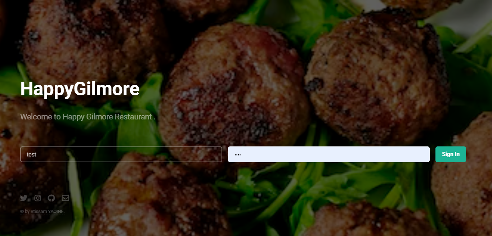

# Happy Gilmore

Happy Gilmore is a restaurant management web application developed with PHP/MySQL that
allows you to manage all aspects of your restaurant from inventory, stock management,
cash management and customer order management and tracking with multiple user roles
(user, supervisor and administrator).

    
    
    
    
    
    
    

    

# Built With
- [PHP](https://www.php.net/docs.php)
- [mySql](https://www.mysql.com/)
- [PhpMyAdmin](https://docs.phpmyadmin.net/_/downloads/en/master/pdf/)
- [HTML5](https://www.w3schools.com/html/)
- [CSS3](https://www.w3schools.com/css/)
- [JavaScript](https://www.w3schools.com/js/DEFAULT.asp)

## Creator / Maintainer

Btissam YAQINE ([btissamyaqine](https://github.com/btissamyaqine))

If you have any questions, comments, or concerns, feel free to contact me below.

  

